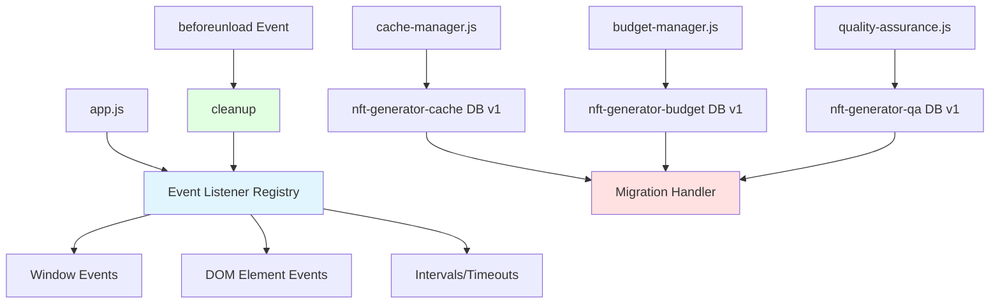

# IndexedDB Database Schema Documentation

## Database: nft-generator-cache (version 1)

**Manager:** ImageCacheManager (cache-manager.js)  
**Purpose:** Persistent caching layer for generated trait images

### Object Stores:
- `traitImages`: Cached trait image data with metadata
- `cacheMetadata`: Cache statistics and configuration
- `configHashes`: Configuration hashes for smart regeneration detection
- `qaMetadata`: Quality assurance metadata for cached images
- `regenerationQueue`: Queue for regenerating failed cached images

## Database: nft-generator-budget (version 1)

**Manager:** BudgetManager (budget-manager.js)  
**Purpose:** Budget tracking and enforcement

### Object Stores:
- `spendRecords`: Historical spending records per provider
- `budgetLimits`: Configured budget limits (daily/monthly)
- `budgetAlerts`: Budget warning and alert history

## Database: nft-generator-qa (version 1)

**Manager:** QualityAssuranceEngine (quality-assurance.js)  
**Purpose:** Quality assurance and image analysis

### Object Stores:
- `qaMetadata`: Quality scores and approval status
- `regenerationQueue`: Queue for regenerating failed quality checks

## Version Migration Strategy

When incrementing database versions:

1. Update the `dbVersion` constant in the respective manager class
2. Add migration logic in the `onupgradeneeded` handler using `if (oldVersion < newVersion)` checks
3. Test migration with existing data before deploying
4. Document schema changes in this file

## Architecture Overview

## Database Separation Rationale

Each database serves a distinct purpose:

- **Cache DB**: Stores generated images and related metadata for performance
- **Budget DB**: Tracks spending and enforces financial limits
- **QA DB**: Manages quality analysis and regeneration workflows

This separation ensures:
- Clear data ownership boundaries
- Independent schema evolution
- Reduced risk of data corruption
- Better performance through focused queries